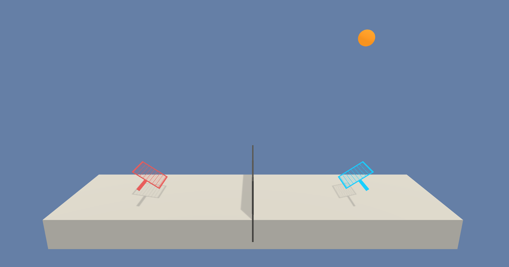

# DRL_Tennis_Project
Tennis project: Train two agents via a deep reinforcement algorithm to complete a task in a 3d environment (continuous states, continuous actions)). 

For an introduction to reinforcement learning and deep reinforcement learning in particular as applied to a similar training problem, we refer to [Cartpole - Introduction to Reinforcement Learning (DQN - Deep Q-Learning)](https://towardsdatascience.com/cartpole-introduction-to-reinforcement-learning-ed0eb5b58288). For an application of the Deep Q-Learning algorithm to a similar environment, we refer to the following github entry: [Solving Unity's Banana Collector environment via DQL](https://github.com/andreaspts/DRL_Navigation_Project).

In this repository, we seek to apply the multi-agent version of the DDPG (deep deterministic policy gradient) algorithm to solve the given environment. For details regarding the DDPG algorithm, we refer to the original literature ([article 1](http://proceedings.mlr.press/v32/silver14.pdf) and [article 2](https://arxiv.org/abs/1509.02971) and the following highly recommendable [link](https://spinningup.openai.com/en/latest/algorithms/ddpg.html). For another application of the DDPG algorithm to the classic inverted pendulum task, we refer to the following [blog post](https://towardsdatascience.com/deep-deterministic-policy-gradients-explained-2d94655a9b7b). The multi-agent version of DDPG was proposed in the article [Multi-Agent Actor-Critic for MixedCooperative-Competitive Environments](https://arxiv.org/pdf/1706.02275.pdf); the pseudo-code is found in its appendix.

### Introduction

<p align="center">
  
</p>

 The environment we are dealing with is the [Unity tennis environment](https://github.com/Unity-Technologies/ml-agents/blob/master/docs/Learning-Environment-Examples.md#tennis). In this problem two agents have tennis rackets to shoot a ball over a net. In case an agent is able to hit the ball over the net, a reward of `+0.1` is released. Whenever an agent misses the ball and it falls to the ground or if the ball is played outside of the bounds, a negative reward of `-0.01` is released. The environment is considered solved, when an average score of `+0.5` over `100` consecutive episodes is obtained.

The overall goal of the agents is thus to keep playing the ball over the net for as long as possible. Hence, this is a cooperative game.

The observation space has `8` (continuous) variables which correspond to the position and velocity of the ball and the racket. An agent can take two continuous actions (of values in the interval `[-1,1]`) which correspond to moving towards the net or away from it, as well as jumping.

For completeness, we give the Unity details of the environment:

```
INFO:unityagents:
'Academy' started successfully!
Unity Academy name: Academy
        Number of Brains: 1
        Number of External Brains : 1
        Lesson number : 0
        Reset Parameters :
		
Unity brain name: TennisBrain
        Number of Visual Observations (per agent): 0
        Vector Observation space type: continuous
        Vector Observation space size (per agent): 8
        Number of stacked Vector Observation: 3
        Vector Action space type: continuous
        Vector Action space size (per agent): 2
        Vector Action descriptions: , 
```
### Getting Started

Computations were done using python `3.6`. In addition, the following packages were mounted: **matplotlib**, **numpy**, **torch** and **unityagents** which is used to run the [Unity tennis environment](https://github.com/Unity-Technologies/ml-agents/blob/master/docs/Learning-Environment-Examples.md#tennis).

The python environment to run the code in this repository is set up by the following steps:

Creation of a new environment with Python `3.6` (or `3.7`).

For Linux or Mac use the terminal with

```
	conda create --name drlnd python=3.6
	source activate drlnd
```
while in Windows type:

```
	conda create --name drlnd python=3.6 
	activate drlnd
```

To install the dependencies type in ```pip install matplotlib```, ```pip install numpy```, ```pip install pytorch torchvision``` and ```pip install unityagents```.


To run the environment it has to be downloaded first. For individual operating systems it can be obtained from:
* Linux: [click here](https://s3-us-west-1.amazonaws.com/udacity-drlnd/P3/Tennis/Tennis_Linux.zip)
* Mac OSX: [click here](https://s3-us-west-1.amazonaws.com/udacity-drlnd/P3/Tennis/Tennis.app.zip)
* Windows (32-bit): [click here](https://s3-us-west-1.amazonaws.com/udacity-drlnd/P3/Tennis/Tennis_Windows_x86.zip)
* Windows (64-bit): [click here](https://s3-us-west-1.amazonaws.com/udacity-drlnd/P3/Tennis/Tennis_Windows_x86_64.zip)


The file has to be unpacked in the folder with the **Jupyter** notebook.

### Instructions

The project can be run by starting the **Jupyter** notebook `Tennis_DDPG_solution.ipynb`. In this notebook classes are called which define the learning agent and the neural network which are saved in `maddpg_agent.py`, `model.py`, `noise.py` and `memory.py`, respectively. Results of the analysis are collected in the `report.md` file.

### License
This repository is licensed under the MIT License.
