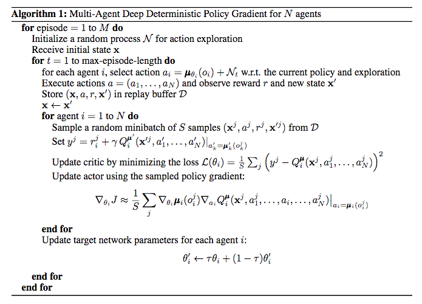
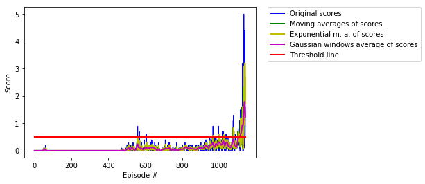
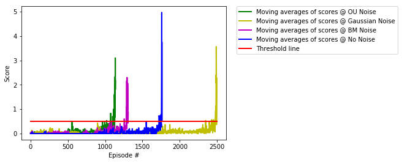

# Project report

## Aspects of the learning algorithm

### Description of the MADDPG (multi-agent deep deterministic policy gradient) algorithm

The employed learning algorithm is the multi-agent version of the DDPG algorithm which was introduced in the article [Multi-Agent Actor-Critic for MixedCooperative-Competitive Environments](https://arxiv.org/pdf/1706.02275.pdf) to solve [Markov Decision Processes](https://en.wikipedia.org/wiki/Markov_decision_process) in multi-agent environments with continuous action spaces.

At the heart of the learning algorithm are two deep neural networks which act as concurrent function approximators, i.e., they learn a Q-function (in an off-policy way via the Bellman equation) and a deterministic policy (via this Q-function) in parallel. 
The DDPG algorithm is a so-called [actor-critic approach](https://towardsdatascience.com/understanding-actor-critic-methods-931b97b6df3f) where the actor is represented by one and the critic by another network. More precisely, the actor network approximates the optimal deterministic policy which implies that the returned action `a` is the best one for any fed-in state `s`. 
In other words, it approximates the `argmax_a(Q(s,a))`-function. The state and action are fed into the critic to approximate the optimal action-value function through the input of the actor’s best action. 
Both networks have target networks (as in the standard deep Q-learning algorithm) to stabilize the algorithm. The respective target networks are copied over from their main counterpart networks every update step. 
The two networks are used by all agents in the given environment. The experiences of each agent are stored in a shared memory to be learnt from.


These points become clearer when following the pseudo-code as taken from the [original literature](https://arxiv.org/pdf/1706.02275.pdf):

<p align="center">
  
</p>

Some explanations are in order. 

The following holds for every agent:

For each and every episode and each and every time step:

1. Fed with a state `s`, the actor network returns an action `a`. After `a` is returned, we also add some noise to the action to encourage stochastic exploration and call this overall action `a`. 
The noise is generated through a [Ornstein-Uhlenbeck process](https://en.wikipedia.org/wiki/Ornstein%E2%80%93Uhlenbeck_process). The code can also be run using Gaussian noise and noise generated
by a Brownian motion.

2. Taking the action `a` leads to a release of the reward `r` and setting the environment to the state `s'`. This gives the experience tuple `<s,a,r,s'>` which is saved in the replay memory (of a particular buffer size). The tuples are added gradually step by step, episode by episode to the buffer.

3. We randomly select a small batch of tuples from this memory (random sampling breaks up time correlations between tuples) and learn from that batch via gradient descent the optimal action-value function and via gradient ascent the optimal deterministic policy. 

More precisely,

for every tuple in the batch:

3.a. We compute the target Q-value. This is done by pluggin `s'` into the target actor network, leading to the next action `a'`. This is put into the target critic network to obtain the next Q-value `Q'`. When discount factor is multiplied to this value and the reward `r` is added we have obtained the target Q-values.

3.b. We compute the expected Q-value from the local critic network from the current state and action. From the expected Q-value and the target Q-value we gain the Temporal Difference error.

3.c. Using this info from all tuples, we obtain the mean squared error which is minimized through gradient descent leading to an update of the weights of the critic network. For this we use the MSELoss loss function (aka L2 loss function) and an Adam optimizer. The latter is also fed with the learning rate determining the speed of the gradient descent.

3.d. With this we are ready to update the actor policy via gradient ascent. For this a new action is obtained by plugging the state `s` into the local actor network. Then Q-values are obtained by plugging the new action and `s` into the local critic network. With this we obtain the actor loss function `J` which is to be maximized thereafter. 
We observe that in the pseudo-code the chain rule is applied. In the code, one simply performs the update of the actor via

```
        # Compute actor loss
        actions_pred = self.actor_local(states)
        actor_loss = -self.critic_local(states, actions_pred).mean()
        # Minimize the loss
        self.actor_optimizer.zero_grad()
        actor_loss.backward()
        self.actor_optimizer.step()
```

4. Finally, a "soft update" of the model parameters connects the local and target models (via Polyak averaging) and is responsible for resetting of weights of the target networks.


### Architectures of the used networks

We are using two simple deep neural networks for both the actor and critic. They are built from `2` fully connected hidden layers coded into the `model.py` file. In particular, for the actor we have

- Fully connected layer - input: `24` (state_size) output: `512` (fc1_units) with ReLU activation
- Fully connected layer - input: `512` (fc1_units) output: `128` (fc2_units) with ReLU activation
- Fully connected layer - input: `128` (fc2_units) output: `2` (action_size) with tanh activation

where we also apply batch normalization after the first layer to improve gradient ascent. 

For the critic we have

- Fully connected layer - input: `24` (state_size) output: `512` (fc1_units) with ReLU activation
- Fully connected layer - input: `514` (fc1_units+action_size) output: `128` (fc2_units) with ReLU activation
- Fully connected layer - input: `128` (fc2_units) (Q-value) output: `1`.

Notice the number of input nodes in the second layer which amounts to `fc1_units+action_size=514`. The concatenation reflects the particular concurrence of the two networks.


### Specification of parameters used in the MADDPG algorithm

We speficy the parameters used in the DDPG algorithm (as in the maddpg-function of the Tennis_DDPG_solution.ipynb notebook):

- We set the number of episodes n_episodes to `10000`. The number of episodes needed to solve the environment and reach a score of `0.5` is expected to be smaller.
- We set the maximum number of steps per episode max_t to `1000`.

Furthermore, we give the parameters used in the `maddpg_agent.py` file:

- The size of the replay buffer BUFFER_SIZE is set to `10^6`.
- The mini batch size BATCH_SIZE is set to `128`.
- The discount factor GAMMA for future rewards is set to `0.99`.
- For both networks, we set the value for the soft update of the target parameters TAU to `10^-3`.
- The learning rate for the gradient descent for the actor network LR_ACTOR is set to `5 * 10^-4`.
- The learning rate for the gradient descent for the critic network LR_CRITIC is set to `5 * 10^-4`.
- The parameter to control the L2 weight decay WEIGHT_DECAY is set to `0`.
- The update rate to control after how many time steps sampling from the memory should be done is set to `1`.


For the [Ornstein-Uhlenbeck noise](https://en.wikipedia.org/wiki/Ornstein%E2%80%93Uhlenbeck_process), we used the parameters (as specified in the previous link):
- `mu=0`
- `theta = 0.15` and
- `sigma = 0.2`.
For the other options to add noise (Gaussian noise and noise through a Brownian motion noise, we also used `mu=0` and `sigma = 0.2`.)

The noise is added to the agent's actions at training time to make it explore better. The consideration of such noise(s) is heuristic so that stochastic exploration is encouraged (see above). 


## Results

With the above specifications we create a training run and report the results. 

We give a plot of the scores over the episodes:

<p align="center">
  
</p>

Therein, we applied a simple and exponential moving average function at window sizes of `3` (green plot and yellow plot, respectively) overlaying the original data (blue). The red line indicates the threshold of `0.5` reward points. More information on how to construct these moving averages in python can be found under the following links:
[Moving average in python](https://www.quora.com/How-do-I-perform-moving-average-in-Python) and [Exponential Moving average in python](https://www.youtube.com/watch?v=3y9GESSZmS0). Notice that the exponential moving average gives more emphasis to recent data than the simple version of it. 
In general, [moving averages](https://en.wikipedia.org/wiki/Moving_average) are a method to smoothen time and data series. 
Yet another plot (in magenta) depicts a running average with a Gaussian type of window which provides a much better smoothening as compared to the others (at least up to closely before the last episodes).
The steep fall off is due to the parameters chosen in the Gaussian averaging function and shall not be of any concern here.

Then we list the average score every `100` episodes up to the point where the agent reaches a score equal or higher than `0.5`: 

```
Episode 1000	Average Score: 0.17	Time needed: 0:10:29.882195
Episode 1010	Average Score: 0.19	Time needed: 0:10:46.354236
Episode 1020	Average Score: 0.20	Time needed: 0:11:06.601826
Episode 1030	Average Score: 0.21	Time needed: 0:11:24.811344
Episode 1040	Average Score: 0.23	Time needed: 0:11:44.304349
Episode 1050	Average Score: 0.23	Time needed: 0:12:00.515441
Episode 1060	Average Score: 0.23	Time needed: 0:12:13.492052
Episode 1070	Average Score: 0.22	Time needed: 0:12:26.884195
Episode 1080	Average Score: 0.24	Time needed: 0:12:52.154166
Episode 1090	Average Score: 0.24	Time needed: 0:13:07.163776
Episode 1100	Average Score: 0.22	Time needed: 0:13:22.058043
Episode 1110	Average Score: 0.25	Time needed: 0:13:55.163272
Episode 1120	Average Score: 0.28	Time needed: 0:14:32.643974
Episode 1130	Average Score: 0.33	Time needed: 0:15:22.124381
Episode 1140	Average Score: 0.49	Time needed: 0:17:14.962335
The enviroment was solved in 1141 episodes, with an average score over 100 consecutive episodes of 0.50. The time needed was 0:17:24.579664.

```

We note here that on different test runs, the environment was solved in about `800` and `2500` episodes which indicates the instability of the algorithm. This could call for the implementation of a more stable algorithm as discussed below.

We tried to obtain better results through slight modifications of the algorithm. To this aim, we implemented batch normalization in the actor and 
critic networks (see code) which also necessitated some modification in the act-method of the Agent-class in the `maddpg_agent.py` file.
Interestingly, the performance was generally worse than without (though one would expect batch normalization to stabilize gradient ascent/descent).
Hence, we continued without batch normalization. Also, using leaky ReLU functions instead of the standard ReLU activations slowed down the learning pace.

We also ran the environment when different noises were added. The results of this experiment are visualized in the following plot: 

<p align="center">
  
</p>

We see that the run using the OU noise was the quickest to solve the environment. Notice, however, that we tried this experiment mutiple times 
and results were rather different. Again, this seems to be an indication that the algorithm as it is is rather unstable calling for improvements,
as discussed hereafter.

## Possible extensions of the setting and future work

1. The hyperparameters should be optimized: For example, we could change the learning rate, the batch size and improve the network structure (more/less layers and units; overfitting could be tackled using dropout or L2 regularization).

2. [Prioritized Experience Replay](https://arxiv.org/abs/1511.05952) could be implemented. In this work the authors extend the idea of experience replay. They introduce a method which prioritizes experiences by replaying important transitions more often which accelerates the learning rate. 

3. The environment could be solved using different algorithms. In particular, 

  a. more stable methods are the Trust Region Policy Optimization (TRPO) and Truncated Natural Policy Gradient (TNPG) which were introduced [here](https://arxiv.org/abs/1604.06778).

  b. the environment could be tackled with the [PPO](https://arxiv.org/pdf/1707.06347.pdf), [A3C](https://arxiv.org/pdf/1602.01783.pdf), and [D4PG](https://openreview.net/pdf?id=SyZipzbCb) algorithms. They can distribute the work of gathering experience to multiple (non-interacting) copies of the same agent.
